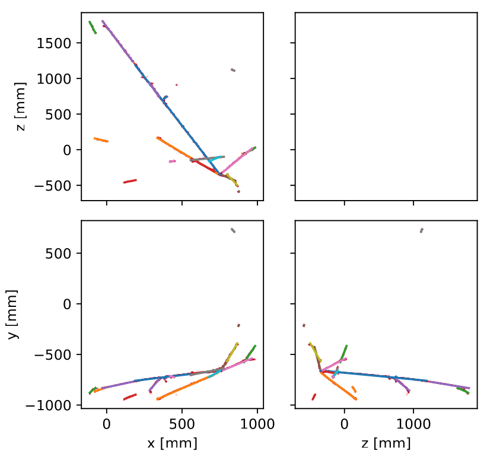

.. LiquidRecO documentation master file, created by
   sphinx-quickstart on Tue Jun 24 11:13:22 2025.
   You can adapt this file completely to your liking, but it should at least
   contain the root `toctree` directive.

LiquidRecO documentation
========================

LiquidRecO is a reconstruction library for particle detectors based on the LiquidO_  opaque scintillator detector technology.

.. _LiquidO: <https://liquido.ijclab.in2p3.fr/overview/>

It provides functionality to create 3 dimensional "hits" from 2 dimensional planes of wavelength shifting fibers. 
And to fit particle tracks to those 3D clouds of hits.

Letting you go from this

.. image:: images/example_neut_event_fibers.png
  :align: center

to this

.. image:: images/example_neut_event.gif
  :align: center

to this

.. toctree::
   :maxdepth: 2
   :caption: 🚀 Getting Started

   intro.md

.. toctree::
   :maxdepth: 2
   :caption: 📖 References
   
   api.rst
   LiquidO 🔗 <https://liquido.ijclab.in2p3.fr/overview/>
   
   
   

